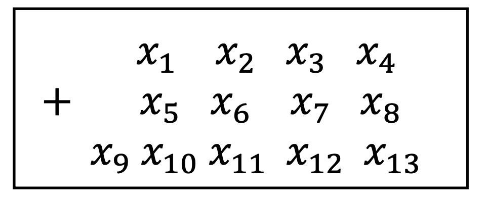
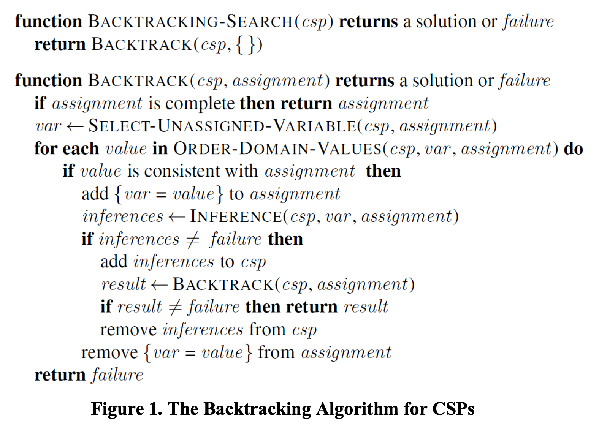

<h1 align=center>Cryptarithmetic Problem</h1>

## Project Description
Design and implement a program to solve Cryptarithmetic problems as shown in the figure below:

  

where 𝑥2 to 𝑥13 can be any capital letter from A to Z; some letters may occur more than once. 

Each letter stands for a distinct digit; the aim is to find a substitution of digits for letters such that the resulting sum is arithmetically correct, with the added restriction that no leading zeros are allowed. The domain for 𝑥9 is therefore {1}, the domain for 𝑥1 and 𝑥5 is {1,2, ... , 9} and the domain for variables 𝑥2 to 𝑥4, 𝑥6 to 𝑥8, and 𝑥10 to 𝑥13 is {0,1,2, ... , 9}. You can introduce auxiliary variables and specify their domains to represent carry overs from previous columns. After this, you can set up a set of constraints for the problem.

## Implementation
The *Backtracking Algorithm* for CSPs in Figure 1 was implemented to solve this problem. 
- The function SELECT-UNASSIGNED-VARIABLE in the algorithm uses the minimum remaining values and degree heuristics. 
- The ORDER-DOMAIN-VALUES function orders the domain values in increasing order (from lowest to highest.) 

  

### Input
Contains three rows (or lines) of capital letters:
- The first and second rows contain four capital letters
- The third row contains five capital letters with no blank space between letters. 

### Output
Contains three rows (or lines) of capital letters:
- The first and second rows contain four digits 0-9
- The third row contains five digits 0-9 with no blank space between letters. 
